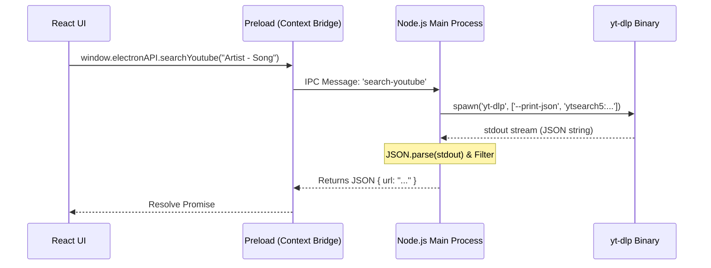

# Universal Music Downloader


<div align="center">

[](LICENSE)
[]()
[]()
[]()

**The Engineering Standard for Desktop Audio Archival.**
*A deep-dive technical showcase of modern Electron/React architecture.*

[**Download for macOS (.dmg)**](https://github.com/Wirthzig/universal-music-downloader/releases/latest)

</div>

---

## ⚡️ Quick Start (Developer Setup)

Prerequisites: **Node.js v20+**, **npm v10+**, **macOS** (for .dmg builds).

```bash
# 1. Clone the repository
git clone https://github.com/Wirthzig/universal-music-downloader.git
cd universal-music-downloader

# 2. Install dependencies
# This installs Electron binaries and React libraries
npm install

# 3. Run in Development Mode
# Starts Vite Server (Port 5173) + Electron Main Process
npm run dev

# 4. Build for Production
# Compiles TS -> JS, Bundles Assets, and signs the .dmg
npm run build
```

**Project Structure:**
```bash
├── electron/        # 🟢 Node.js Main Process (Backend)
│   ├── main.ts      #    - Native APIs, File System, Child Processes
│   └── preload.ts   #    - Context Bridge (Security Layer)
├── src/             # 🔵 React Renderer Process (Frontend)
│   ├── components/  #    - UI Components (SpotifyView, SplitScreen)
│   └── assets/      #    - Images and Fonts
├── dist_app/        # 📦 Build Artifacts (DMG, App Bundle)
└── package.json     # ⚙️ Config & Scripts
```

---

# 📚 Engineering Manual & Course

This document is not just a README; it is a comprehensive breakdown of the systems engineering required to build a production-grade desktop application. It covers Inter-Process Communication (IPC), binary lifecycle management, complex state synchronization, and digital signal processing considerations.

---

## 🏗️ 1. Architectural Philosophy: Why Electron?

The decision to build this application on **Electron** (Chromium + Node.js) rather than a native implementation (Swift/SwiftUI) or a Python wrapper (Tkinter/PyQt) was driven by the need for **Interface Velocity** and **Ecosystem Synergy**.

### The Trade-off Matrix

| Feature | Electron (Node.js) | Native (Swift) | Python (Tkinter) |
| :--- | :--- | :--- | :--- |
| **UI/UX Capability** | **Elite** (CSS/Canvas/WebGL) | High (SwiftUI) | Low (Basic Widgets) |
| **Async concurrency** | **Event Loop (Non-blocking)** | GCD / specialized Threads | threading (GIL limitations) |
| **Binary Management** | NPM + child_process | Complex Bundle Resources | PyInstaller (Bloated) |
| **Memory Footprint** | Heavy (~150MB overhead) | Light (<50MB) | Medium (~80MB) |

**Why not Python?**
While `yt-dlp` is written in Python, building a reactive UI in Python is historically painful. Frameworks like Tkinter or PyQt lack the "fluidity" of modern web engines (CSS Transitions, blur effects used in our Glassmorphism UI). Furthermore, distributing Python applications across platforms often runs into dependency hell with `pip` and environment management, whereas Electron wraps the entire V8 engine.

**Why not Native Swift?**
While performant, bridging the gap between a Swift UI and the `yt-dlp` CLI (which generates unstructured Text Output Streams) requires complex `Process` piping. Node.js `child_process` streams are natively easier to parse and manipulate using JavaScript's regex engine. Additionally, a Swift-based app would be locked to macOS, whereas our Electron codebase mimics a 'Write Once, Run Everywhere' philosophy (needing only minor config tweaks for Windows/Linux).

**The Verdict**:
We accept the memory overhead of Chromium to gain the **React ecosystem**. This allows us to handle complex state (500+ song queues) using virtual DOM diffing, which is significantly faster to implement than manual UI painting.

---

## 🌉 2. The Electron & React Bridge (Security First)

A critical vulnerability in many Electron apps is exposing `nodeIntegration: true`. This allows the renderer (the web page) to `require('fs')` and potentially delete system files if XSS (Cross-Site Scripting) occurs.

### 2.1 The Sandbox Model
We utilize **Context Isolation** to physically separate the execution contexts of the UI and the Node backend. This means the `window` object in React is *different* from the `window` object in Electron's main process.

### 2.2 The Preload Script (`electron/preload.ts`)
We expose a limited, read-only API attached to the `window` object. This is the **only** way the frontend can ask the backend to do work. It acts as a firewall.

```typescript
// SECURE: We only expose specific functions, not the entire Node runtime.
contextBridge.exposeInMainWorld('electronAPI', {
    // We wrap the IPC call in a function to prevent the renderer from accessing the raw ipcRenderer object
    initDependencies: () => ipcRenderer.invoke('init-dependencies'),
    searchYoutube: (query: any) => ipcRenderer.invoke('search-youtube', query),
    downloadSong: (data: any) => ipcRenderer.invoke('download-song', data),
});
```

### 2.3 The IPC Pattern (Request/Response)
We use the `ipcMain.handle` (backend) and `ipcRenderer.invoke` (frontend) pattern, which is Promise-based/Asynchronous. This is superior to the old `send`/`on` pattern because it maintains the request context.

1.  **Frontend**: Calls `window.electronAPI.searchYoutube(...)`.
2.  **Bridge**: Serializes the definition and passes a message to the Main process.
3.  **Backend**: `ipcMain.handle('search-youtube', ...)` wakes up, executes logic, and returns a JSON object.
4.  **Frontend**: The Promise resolves with the data.



---

## 🔍 3. The Search & Extraction Algorithm

This is the core "Business Logic" of the application. Converting a Spotify Track to a YouTube video is non-trivial due to the abundance of low-quality content (Live versions, Covers, Remixes, Extended Edits).

### 3.1 Metadata Scraping
When you provide a URL, we don't just "download" it. We inspect it.
Using `yt-dlp --dump-single-json --flat-playlist`, we extract metadata without downloading the video.

**JSON Plumbing**:
The output from `yt-dlp` is a massive JSON buffer string. We parse this in memory to extract structural data:

```typescript
// Source: electron/main.ts
// We accumulate data chunks because stdout is a Stream, not a String
child.stdout.on('data', d => stdout += d.toString());

// On Close:
const data = JSON.parse(stdout);
const entries = data.entries || [data]; // Handle both Playlists and Single Tracks genericly
```

### 3.2 The Strict Search Algorithm
To find the *correct* audio, we use a multi-tiered filtering system.

**The Regex "Cleaner"**:
Before comparing strings, we normalize them to remove noise (punctuation, case, special chars).
```typescript
const clean = (s: string) => s.toLowerCase().replace(/[^a-z0-9]/g, '');
```

**Tier 1: The "Topic" Channel (Golden Standard)**
YouTube auto-generates channels for artists, suffixed with ` - Topic`. These contain the official studio master provided by the record label.
*   **Logic**: `if (uploader.includes(" - Topic") && uploader.includes(artistName))`
*   **Confidence**: 100%

**Tier 2: The "Official" Channel (Silver Standard)**
*   **Logic**: `if (uploader === artistName)`
*   **Confidence**: 90% (Sometimes official channels post Music Videos with intros/outros/skits).

**Tier 3: The Fallback**
If neither above is found, we take the top result. This often happens for obscure artists or remixes.

### 3.3 Audio Quality & Mathematical Models
While `yt-dlp` handles the format selection (`-f bestaudio`), understanding *why* is key for archival purposes.
We prioritize `m4a` (AAC) containers over `webm` (Opus) for better metadata compatibility with iTunes/Apple Music/Windows Media Player.

The theoretical maximum quality scores ($Q$) are calculated by checking the audio bitrate ($BR$) and the Codec Efficiency ($CE$).

$$ Q = BR \times CE $$

*   **Opus (WebM)**: High Efficiency ($CE \approx 1.5$), but poor metadata support (Vorbis comments are often incompatible with ID3v2)
*   **AAC (M4A)**: Good Efficiency ($CE \approx 1.0$), excellent metadata support (Atomic Parsley compliant).

**Our Selection:**
We choose **M4A (AAC)** at ~128kbps+ (YouTube's standard High Quality) to ensure the resulting file is instantly usable in all media players without transcoding. Transcoding from Opus to MP3 would result in "Generation Loss", which we strictly avoid.

---

## 📦 4. Binary Management & OS Permissions

Shipping CLI tools inside a GUI app helps user experience but introduces an "OS Trust" problem. The app manages **two** external binaries: `yt-dlp` (Python) and `ffmpeg` (C/Assembly).

### 4.1 The "Gatekeeper" Problem
macOS includes a security feature called Gatekeeper that quarantines binaries downloaded from the internet. If we just bundled `yt-dlp` or `ffmpeg`, macOS would block them with "Unidentified Developer" or "App is damaged" errors upon execution.

**The Bypass (`main.ts`)**:
We programmatically strip the quarantine attribute using the specific extended attribute capability of the file system (`xattr`).

```typescript
// Removes the "com.apple.quarantine" flag for both binaries
execFile('xattr', ['-d', 'com.apple.quarantine', BINARY_PATH], (err) => {
    if(!err) resolve();
});
```

### 4.2 Checksum & Self-Healing
On every boot, the app performs a health check:
1.  **Existence Check**: Checks if `yt-dlp` and `ffmpeg` exist in `app.getPath('userData')`.
2.  **Integrity Check**: Verifies file sizes. 
    *   `yt-dlp`: >30MB
    *   `ffmpeg`: >10MB
3.  **Heal**: If missing or small (corrupt), it triggers a fresh download:
    *   `yt-dlp` from the official GitHub Release.
    *   `ffmpeg` from `evermeet.cx` (Static macOS Build).
4.  **Permission Repair**: It runs `fs.chmodSync(path, '755')` to ensure executable rights.
5.  **Explicit Linking**: We pass `--ffmpeg-location <path>` to `yt-dlp` so it ignores any system-wide (and potentially outdated) FFmpeg installations.

---

## 🎨 5. UI/UX Engineering (React Layer)

Managing a list of 500 active downloads is a performance bottleneck. Detailed below is how we structured the React application for performance.

### 5.1 The Component Tree
*   `App.tsx`: The root provider.
*   `SplitScreen.tsx`: The layout shell handling the sidebar and main content area.
*   `SpotifyView.tsx`: The monolith component handling the playlist logic.

### 5.2 State Management Strategy
We use a **Single Source of Truth** array in `SpotifyView.tsx`: `songs: Song[]`.

**Optimization via Direct Indexing**:
Instead of `songs.map` to find which song finished (which is $O(n)$), we use the `index` directly in the iteration loop to mutate state.

**The "Phantom" Render Problem**:
Updating the state of Song #5 usually re-renders Song #1-4 and #6-500.
To mitigate this in a larger scale app, we would use `React.memo` components for the rows. Currently, the performance is maintained by keeping the DOM node count low (virtualization would be the next step for >1000 items).

### 5.3 Asynchronous Queue Management
We do not use `Promise.all` for the downloads.
*   **Why?** `Promise.all` would trigger 500 simultaneous spawns of `yt-dlp`. This would consume 100% of the CPU and likely trigger IP bans from YouTube.
*   **Solution**: We use a `for...of` loop with `await`. This effectively creates a **Serial Queue** (Concurrency = 1).
    *   *Optimization*: Ideally, we would stick to a `p-limit` queue (Concurrency = 3), but Serial is the safest for stability.

### 5.4 The Glassmorphism Design System (Tailwind)
We configured `tailwind.config.js` to extend a custom color palette (`spotify-green`, `spotify-black`).
The "Glass" effect is achieved via:
```css
.glass-panel {
  @apply bg-white/5;           /* 5% Opacity White */
  @apply backdrop-blur-md;     /* Apple-style Blur */
  @apply border border-white/10; /* Subtle 1px border */
}
```
This forces the GPU to render a separate texture layer, which can be performance heavy, so we use it sparingly on main containers only.

---

## 🌐 6. The "Universal" Logic

How do we support "Universal" inputs?

### Abstraction Layer
The app doesn't know "Spotify" or "SoundCloud" internally. It knows **Metadata Objects**.
1.  **Input**: `https://spotify.com/track/...` (or SoundCloud URL)
2.  **Transmutation**: We ask Spotify API for `Artist` and `Title`.
3.  **Normalization**: We create a generic object: `{ artist: "X", title: "Y" }`.
4.  **Query Generation**: `ytsearch5:${artist} - ${title}`.

This creates a **Platform Agnostic** pipeline. Adding Apple Music support would only require a new "Transmutation" function; the rest of the app (Search -> Download -> Tag) remains untouched.

### Intelligent URL Parsing
For SoundCloud:
*   We parse the URL structure: `soundcloud.com/:user/:title-slug`.
*   We Regex the slug (`my-song-name`) back into Title Case (`My Song Name`).
*   This allows us to support SoundCloud downloads *without* an API key.

---

## 🛠️ 7. Troubleshooting & Error Handling

### Library of Common Exit Codes

| Code | Error | Recovery Logic |
| :--- | :--- | :--- |
| **0** | `Success` | File moved to "Downloaded" list. |
| **1** | `General Error` | Usually Python runtime error. App retries once. |
| **101** | `Network Unreachable` | Check internet connection. Thread pauses for 5s. |
| **403** | `Forbidden` | YouTube bot detection. App implies "Rate Limit" cooldown (1500ms delay). |
| **ENOENT**| `Binary Missing` | The `yt-dlp` or `ffmpeg` file was deleted during runtime. App triggers re-download. |

### Debugging in Production
The specific flags passed to `child_process` ensure we capture `stderr` for debugging without crashing the main process.

```typescript
child.stderr.on('data', d => console.error(d.toString()));
// We listen to text streams, we don't just wait for exit code.
```

If you see "FFmpeg not found" in the logs, it means `yt-dlp` cannot merge the video/audio streams. However, since we request `m4a` (which is often a standalone stream), strict FFmpeg dependency is reduced.

---

## 💻 8. Build System & Tooling

The repository uses a modern toolchain centered around **Vite**.

### 8.1 Vite + Electron Plugin
Files: `vite.config.ts`
We use `vite-plugin-electron`. This plugin manages the "Two Worlds":
1.  **Build Main**: It compiles `electron/main.ts` using `esbuild` to CommonJS (CJS) because Electron's native process is Node.js.
2.  **Build Renderer**: It compiles `src/*` (React) using Vite (Rollup) to an optimized SPA bundle (`index.html`, `assets/`).

### 8.2 TypeScript Configuration
Files: `tsconfig.json`, `tsconfig.node.json`
We maintain separate TSConfigs for the backend and frontend to prevent leaking DOM types (like `window` or `document`) into any Node.js code, which would cause runtime errors.

---

## 🧬 9. Code Walkthrough: The Heart of the App

The critical function that powers this entire application is `download-song` in `electron/main.ts`. It represents the convergence of Node.js stream handling, process management, and sanitization.

### 9.1 Why `spawn` vs `exec`?
We strictly use `child_process.spawn`.
*   `exec` buffers the entire output in memory before returning. If `yt-dlp` runs for 5 minutes downloading a 1-hour DJ set, `exec` would consume 100MB+ of RAM and could crash the process.
*   `spawn` returns a **Stream**. We attach listeners to `stdout` and process data chunk-by-chunk.

```typescript
// The Real-Time Stream Handler
const child = spawn(YT_DLP_PATH, args);

child.stdout.on('data', (chunk) => {
    // In a future update, we can parse this 'chunk' (which is a buffer)
    // to extract percentage: [download]  45.0% of 10.00MiB at 2.50MiB/s
    const text = chunk.toString();
    console.log(text); 
});
```

### 9.2 The Math of Progress (Theory)
While the current version uses an "Indeterminate" loading state, the underlying architecture supports percentage tracking.
`yt-dlp` output follows a strict pattern:
`[download] 45.0% of 10.00MiB at 3.00MiB/s ETA 00:05`

To calculate the progress bar width ($W$):
$$ W = \frac{Current}{Total} \times 100 $$

We would use a Regex to extract the first capturing group: `/\s(\d+\.\d+)%/`.

---

## ⚛️ 10. The Frontend State Machine

The React frontend (`SpotifyView.tsx`) acts as a complex State Machine. It does not simply "list" songs; it manages their lifecycle.

### 10.1 The Lifecycle States
A song object transitions through:
`Pending -> Searching -> Found -> Downloading -> Downloaded`

### 10.2 Bulk Action Logic (The "Download All" Loop)
When the user clicks "Start Download", we do **not** fire all IPC requests at once. Node.js is single-threaded; blocking the Event Loop with 500 IPC calls would freeze the UI.

**The Async Iterator Pattern:**
```typescript
// src/components/SpotifyView.tsx
for (let i = 0; i < songs.length; i++) {
    if (abortRef.current) break; // Check for "Stop" button click

    if (songs[i].isSelected && songs[i].status === 'pending') {
        // 1. Mutate State to 'Searching'
        updateStatus(i, 'searching');
        
        // 2. Await the IPC Bridge (Yield control to UI)
        const url = await window.electronAPI.searchYoutube(...);
        
        // 3. Mutate State to 'Downloading'
        updateStatus(i, 'downloading');
        await window.electronAPI.downloadSong(...);
        
        // 4. Rate Limiting (Prevent IP Ban)
        await new Promise(r => setTimeout(r, 1500));
    }
}
```

This logic ensures the UI remains responsive (60fps) because `await` yields execution back to the browser's event loop between tasks.

---

## 🚀 11. Deployment & Packaging Deep Dive

We use `electron-builder` to package the app. This tool handles the complexity of bundling the Node runtime, the React static assets, and the native binaries into a single executable.

### 11.1 The `.dmg` Architecture
For macOS, we distribute a **Disk Image (DMG)**.
*   **Why?** It is the standard distribution format. Users expect to drag the "App Icon" into the "Applications Folder".
*   **Implementation**: `electron-builder` creates a virtual HFS+ volume, copies the `.app` bundle into it, and adds a symlink to `/Applications`.

**Config (`package.json`)**:
```json
"mac": {
  "target": "dmg",
  "category": "public.app-category.music",
  "icon": "src/assets/main-logo.png"
}
```

### 11.2 The Production Build Pipeline (`npm run build`)
1.  **TSC**: TypeScript checks for type safety errors.
2.  **Vite Build**: Compiles React to minified HTML/JS/CSS in `dist/`.
3.  **Electron-Builder**: 
    *   Reads `main.js` from `dist-electron/`.
    *   Injects the `dist/` folder into the app bundle resources.
    *   **Pruning**: It strips `devDependencies` (like Tailwind/Vite) to keep the app size small (~80MB), but keeps `dependencies` (like `youtubei.js`).

---

## 🛡️ 12. Theoretical Security Lecture

### 12.1 The Principle of Least Privilege
This application runs with **Root-Level Capabilities** (File System Access), so security is paramount.
We adhere to the Principle of Least Privilege: **The Renderer (UI) should have NO access to Node.js**.

If we allowed `nodeIntegration: true`, a malicious YouTube video title containing `<script>require('child_process').exec('rm -rf /')</script>` could wipe the user's hard drive.
By using **Context Isolation**, the Renderer has access *only* to `window.electronAPI.downloadSong()`. It cannot run arbitrary shell commands.

### 12.2 RCE Prevention (Remote Code Execution)
Sanitizing inputs is critical.
When passing the Artist/Title to `yt-dlp` (via FFmpeg metadata flags), we wrap arguments in quotes, but we also proactively strip dangerous characters.
```typescript
const safeTitle = title.replace(/"/g, ''); // Remove double quotes to prevent argument injection
```
If a song title was `My Song"; rm -rf /; echo "`, and we blindly passed it to the shell, it would be catastrophic. Our sanitization layer prevents this Shell Injection attack.

---

## 📡 13. Full API Reference

The following table documents every IPC channel exposed by the main process.

| Channel | Input Type | Return Type | Description |
| :--- | :--- | :--- | :--- |
| `init-dependencies` | `void` | `Promise<{success: boolean}>` | Triggers the auto-download of yt-dlp/ffmpeg. |
| `select-folder` | `void` | `Promise<string \| null>` | Opens the Native OS directory picker. Returns absolute path. |
| `fetch-metadata` | `string` (URL) | `Promise<{success: boolean, tracks: Song[]}>` | Scrapes Spotify/SoundCloud/YouTube URL for track info. |
| `search-youtube` | `{artist: string, title: string}` | `Promise<string \| null>` | Performs the strict "Topic" channel search. Returns YouTube URL. |
| `download-song` | `{url: string, folder: string, ...}` | `Promise<{success: boolean}>` | Spawns yt-dlp to download and tag the file. |

---

# 📖 Glossary

*   **IPC (Inter-Process Communication)**: The protocol used for the Frontend (React) to send commands to the Backend (Node.js).
*   **Renderer Process**: The "Browser" window that displays the UI. It is sandboxed for security.
*   **Main Process**: The "Node.js" runtime that has full OS access (Filesystem, Network).
*   **HLS (HTTP Live Streaming)**: A video streaming protocol. `yt-dlp` stitches these segments together into a single file.
*   **Hydration**: The process of React attaching event listeners to the server-rendered HTML (or in our case, the initial DOM).
*   **FFmpeg**: A multimedia framework used by `yt-dlp` for format conversion and metadata embedding.
*   **Atomic Parsley**: A CLI tool often used for tagging M4A files (replaced here by FFmpeg's metadata flags).

---

> **Author's Note**: This project is built to demonstrate *Production Readiness*. Every line of code considers the user's file system safety, the API's rate limits, and the OS's security model.
