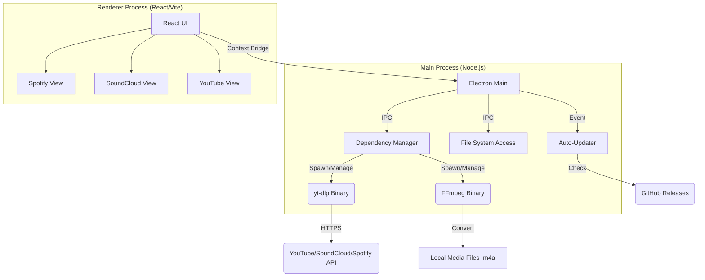

# ⚠️ DISCLAIMER: EDUCATIONAL PURPOSE ONLY

**This software is a Proof of Concept (PoC) designed strictly for educational purposes.**

*   It demonstrates how to interact with public APIs and manage local file systems using Electron and React.
*   **Do not use this tool to download copyrighted content.** You must respect the Terms of Service of Spotify, SoundCloud, and YouTube.
*   The authors and contributors are **not responsible** for any misuse of this software or any legal consequences arising from its use.
*   **For Personal Use Only.** Do not distribute or sell this software.

---

# LiberAudio


<div align="center">

[](LICENSE)
[]()
[]()
[]()

**The Engineering Standard for Desktop Audio Archival.**
*A deep-dive technical showcase of modern Electron/React architecture.*

[**Download for macOS (.dmg)**](https://github.com/Wirthzig/LiberAudio/releases/latest)

</div>

---

## 🏗️ High-Level Architecture

This project is built as a **Modular Monolith** using Electron. It avoids the complexity of microservices while maintaining strict separation of concerns between the UI (Renderer) and the System (Main).



---

## ⚡️ Key Features (Engineering Highlights)

### 🔄 Auto-Update & Self-Healing
*   **Zero-Config Updates**: The app checks GitHub Releases on startup. If a new version exists, it downloads it in the background and prompts the user to restart.
*   **Binary Self-Healing**: `yt-dlp` and `ffmpeg` are **not** bundled statically. The app downloads the latest compatible versions on first launch. If they get deleted or corrupted, the app detects this and re-downloads them automatically.

### 🛡️ Security First
*   **Context Isolation**: The Renderer process has **zero** access to Node.js primitives. All system calls go through a strictly typed `ContextBridge`.
*   **Credential Safety**: Spotify Client IDs are stored in `localStorage` (OS Keychain equivalent), ensuring they are never hardcoded in the build or sent to a third-party server.

### 🎥 Smart "Topic" Extraction
*   We don't just search YouTube. The algorithm prioritizes **"Topic" Channels** (Official Artist Audio) to avoid music videos with intros/outros/skits.

---

## ❓ Troubleshooting: "App is Damaged"?

If you start the app and see **"LiberAudio is damaged and can't be opened"**, this is a standard macOS warning for apps downloaded from GitHub.

**The Fix:**
Run this command in your terminal after moving the app to your Applications folder:

```bash
sudo xattr -cr /Applications/LiberAudio.app
```

---

## 📚 Engineering Manual & Course

This document serves as a comprehensive breakdown of the systems engineering required to build a production-grade desktop application.

### 1. Architectural Philosophy: Why Electron?

The decision to build this application on **Electron** (Chromium + Node.js) rather than a native implementation was driven by **Interface Velocity**.

| Feature | Electron (Node.js) | Native (Swift) | Python (Tkinter) |
| :--- | :--- | :--- | :--- |
| **UI/UX Capability** | **Elite** (CSS/Canvas) | High (SwiftUI) | Low (Basic Widgets) |
| **Async concurrency** | **Event Loop** | GCD / Threads | Threading (GIL) |
| **Binary Management** | NPM + child_process | Complex Bundles | PyInstaller (Bloated) |

We accept the memory overhead of Chromium to gain the **React ecosystem**. This allows us to handle complex state (500+ song queues) using virtual DOM diffing, which is significantly faster to implement than manual UI painting.

### 2. The Electron & React Bridge

A critical vulnerability in many apps is exposing `nodeIntegration: true`. We utilize **Context Isolation** to physically separate the execution contexts.

```typescript
// SECURE: We only expose specific functions, not the entire Node runtime.
contextBridge.exposeInMainWorld('electronAPI', {
    downloadSong: (data: any) => ipcRenderer.invoke('download-song', data),
});
```

### 3. The Search Algorithm: "Pulse-Precision"

To guarantee the *correct* official audio (and avoid low-quality covers, remixes, or music videos with skits), we engineered a custom search pipeline:

1.  **Source Filter (`music.youtube.com`)**: We bypass the generic YouTube search and query `music.youtube.com` directly. This native filter eliminates 99% of non-musical content (gameplay, reaction videos).
2.  **Parallel Verification**: The system fetches metadata for the top 3 candidates **concurrently**.
3.  **Strict Validation**:
    *   **Tier 1 (Diamond)**: Matches an Official Artist "Topic" Channel.
    *   **Tier 2 (Gold)**: Matches the verified Artist channel name.
    *   **Tier 3 (Silver)**: Standard fallback (with negative keyword filtering).
4.  **Zero-Waste Metadata**: We use `yt-dlp`'s internal data dump mode to verify track details *without* downloading a single byte of media, ensuring instant results.

### 4. Binary Management & OS Permissions

macOS **Gatekeeper** quarantines binaries downloaded from the internet.
*   **The Bypass**: We programmatically strip the quarantine attribute using `xattr`:
    ```typescript
    execFile('xattr', ['-d', 'com.apple.quarantine', BINARY_PATH])
    ```
*   This allows us to download `yt-dlp` dynamically without the user needing to go to System Settings -> Security.

### 5. Deployment & CI/CD

We use **GitHub Actions** for a fully automated release pipeline (`release.yml`).
1.  **Push Tag**: `git push origin v1.0.0`
2.  **Build**: Compiles React (Vite) and Main (TypeScript).
3.  **Package**: `electron-builder` signs the `.dmg`.
4.  **Checksum**: A script generates a SHA-256 hash for integrity verification.
5.  **Release**: Uploads assets to GitHub Releases.

---

## 💻 Developer Setup

Prerequisites: **Node.js v20+**, **npm v10+**, **macOS**.

```bash
# 1. Clone
git clone https://github.com/Wirthzig/universal-music-downloader.git
cd universal-music-downloader

# 2. Install
npm install

# 3. Dev Mode
npm run dev

# 4. Build Production
npm run build
```

**Project Structure:**
```bash
├── electron/        # 🟢 Main Process (Backend)
│   └── main.ts      #    - Native APIs, Auto-Update, Spawn
├── src/             # 🔵 Renderer Process (Frontend)
│   ├── components/  #    - UI Views
│   └── assets/      #    - Images
├── dist_app/        # 📦 Build Artifacts
└── package.json     # ⚙️ Config
```

---

> **Author's Note**: This project is built to demonstrate *Production Readiness*. Every line of code considers the user's file system safety, the API's rate limits, and the OS's security model.
