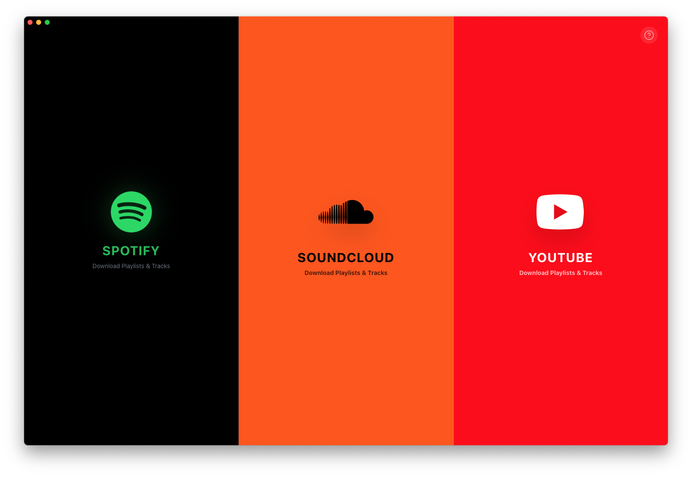
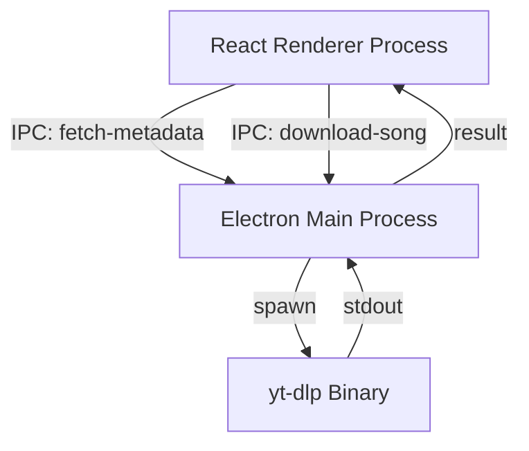

# Universal Music Downloader



<div align="center">

[](LICENSE)
[]()
[]()
[]()

**The ultimate desktop utility for archiving Spotify playlists.**  
*Seamlessly bridge the gap between streaming metadata and local audio files.*

[**Download for macOS (.dmg)**](dist_app/SpotifyDownloader-1.0.0-arm64.dmg)

</div>

---

## 🚀 Product Overview

Universal Music Downloader is a high-performance, self-contained desktop application designed to liberate your music library. Built with **Electron** and **React**, it offers a premium "glass-morphism" UI that feels right at home on macOS.

Unlike command-line tools, this app provides a robust, visual interface for managing downloads, ensuring you always get the highest quality audio with correct metadata, album art, and organizational structure.

### Key Features
*   **Zero Dependencies**: Comes bundled with a self-managed `yt-dlp` binary. No Python or CLI knowledge required.
*   **Smart Matching Algorithm**: Intelligently searches YouTube for "Topic" channels and Official Audio to avoid low-quality fan uploads.
*   **High-Fidelity Audio**: Downloads best available M4A streams (AAC) and embeds accurate ID3 tags.
*   **Resilient Queue System**: Manages hundreds of songs without crashing or freezing.

---

## 🛠️ Engineering Deep Dive: How it Works

This project serves as a masterclass in modern desktop application architecture. Below is a breakdown of the complex engineering challenges solved in this repository.

### 1. Electron Architecture: The Dual-Process Model
The app leverages Electron's multi-process architecture to ensure the UI remains buttery smooth, even during heavy file I/O operations.

*   **Main Process (Node.js)**: Acts as the "Backend". It handles OS-level operations (File System, Child Processes), manages the `yt-dlp` binary, and executes raw shell commands.
*   **Renderer Process (React)**: The "Frontend" UI. It holds zero business logic regarding files; instead, it orchestrates the workflow via a secure **Inter-Process Communication (IPC)** bridge.



### 2. The `yt-dlp` Engine Integration
We don't just "run" yt-dlp; we manage its entire lifecycle.
*   **Binary auto-detection**: On startup, the Main process checks for the existence and integrity of the `yt-dlp` binary in the user's `AppData`.
*   **Self-Healing**: If the binary is missing or corrupted, the app automatically pulls the latest macOS release from GitHub, sets `chmod 755` permissions, and removes the Apple Quarantine attribute (`xattr -d com.apple.quarantine`) to ensure execution rights.

### 3. Intelligence & Strict Filtering
Downloading just "any" match from YouTube results in poor quality (live versions, fan covers). We implemented a **Strict Filtering Algorithm**:

1.  **Search**: Queries `ytsearch5:[artist] - [title]` to fetch the top 5 candidates.
2.  **Filter Level 1 (Gold Standard)**: Looks for a result where `uploader` contains " - Topic". These are auto-generated by YouTube Music and guarantee studio quality.
3.  **Filter Level 2 (Silver Standard)**: Matches results where the `uploader` correctly matches the artist's name (Official Channels).
4.  **Fallback**: If no verified match is found, it defaults to the highest ranked result but flags it for the user.

### 4. Concurrency & State Management
Managing a queue of 500+ songs requires careful event loop management.
*   **Asynchronous Serialization**: Instead of firing 500 requests at once (which would trigger IP bans or OOM errors), the Renderer process utilizes an `async/await` loop.
*   **Non-Blocking UI**: By awaiting the IPC response (`window.electronAPI.downloadSong`), we yield control back to the React event loop between items. This ensures the UI remains responsive to clicks and drags, even while the Node process is crunching heavy ffmpeg tasks in the background.

---

## 🗺️ Roadmap

*   [ ] **Cross-Platform Support**: Packaging for Windows (.exe) and Linux (.AppImage).
*   [ ] **Format Conversion**: Optional FFmpeg post-processing for MP3/FLAC.
*   [ ] **Playlist Sync**: Periodic checking of playlists to auto-download new tracks.
*   [ ] **Metadata Editor**: Built-in editor to manually fix tags before downloading.

---

## ⚖️ Security & Legal Disclaimer

**For Educational and Personal Archiving Use Only.**
This software is designed to help users archive metadata and legally accessible audio streams. The developers do not endorse copyright infringement. Users are responsible for ensuring they comply with their local laws and the terms of service of the third-party platforms involved.
*   **DMCA Compliance**: This tool does not bypass DRM (Digital Rights Management). It accesses publicly available streams.

---

## 👨‍💻 Installation for Developers

If you wish to contribute or modify the codebase, follow these steps:

1.  **Clone the Repository**
    ```bash
    git clone https://github.com/your-username/Universal-Music-Downloader.git
    cd Universal-Music-Downloader
    ```

2.  **Install Dependencies**
    ```bash
    npm install
    ```

3.  **Run in Development Mode**
    This will start the Vite server and launch the Electron container.
    ```bash
    npm run dev
    ```

4.  **Build for Production**
    To compile the React app and package the Electron binary (creates `.dmg`).
    ```bash
    npm run build
    ```
